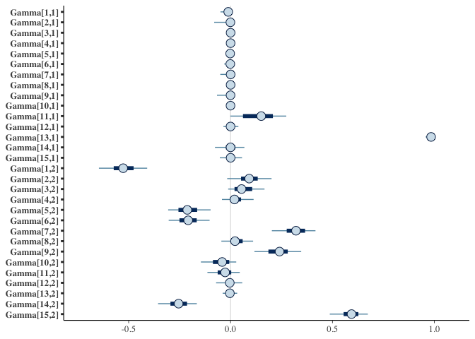
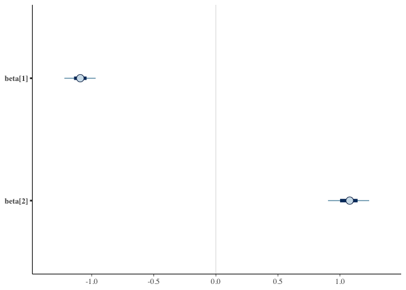
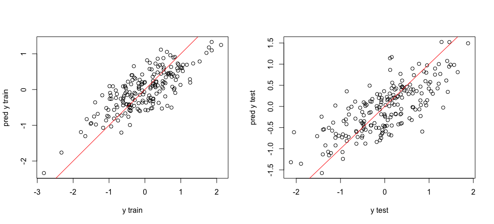

# BSN: Bayesian Scalar-on-network Regression
This repository contains the code implementing the Bayesian scalar-on-network (BSN) regression proposed in https://arxiv.org/abs/2401.16749.

<!-- README.md is generated from README.Rmd. Please edit that file -->

## An illustrating example

Below we demonstrate the use of the proposed method (`BSN`) using
simulated data.

First, load the necessary functions, packages, and the stan model:

``` r
source("function.R")
library(expm)
library(pracma)
library(cmdstanr)
library(bayesplot)
bsn <- cmdstan_model("BSN-T(S).stan")
```

We simulate data following the setup in [our
manuscript](https://arxiv.org/abs/2401.16749), for a case with the
following parameters

- Number of variables (i.e. ROIs): `p = 15`
- Number of reduced dimensions: `d = 2`
- Training sample size: `n_train = 200`
- Testing sample size: `n_test = 200`

``` r
## generate predictor matrices
set.seed(111)
n_train <- n_test <- 200; p <- 15; d <- 2
n <- n_train+ n_test
Ms <- array(NA, dim = c(n, p, p)) 

for(i in  1: n){
  U <- randortho(p) 
  Ms[i,,] <- U%*%diag(exp(runif(p, -2, 2)))%*%t(U) 
}

## map matrices to the tangent space
M_ast_inv_square_root <-  matrixsqrtinv(apply(Ms, c(2,3), mean))
X_tan_log <- array(NA, dim = c(n, p, p)) 
for(i in 1:n){
  X_tan_log[i,,] <- logm(M_ast_inv_square_root %*% Ms[i,,]%*%M_ast_inv_square_root)
}


## generate Gamma matrix and B
nl <- p*d - d^2/2 - d/2
theta <- runif(nl, -pi/2, pi/2)
theta[sample(1:nl, 0.5*round(nl))] <- 0
Gamma <- theta_to_gamma(theta, p, d)
B <- diag(c(-1,1))
Gamma <- Gamma %*% diag(sign(diag(Gamma[apply(abs(Gamma), 2, which.max),])))  # adjust the sign


## generate response
y <- rep(NA, n)
for(i in 1:n){
  y[i] <- sum ((t(Gamma)%*%X_tan_log[i,,]%*%Gamma) * B)
}
y <- y + rnorm(n, 0, 0.5)
```

The true values of the parameters `Gamma` and `B` are as follows:

``` r
print(Gamma)
```

    ##                [,1]         [,2]
    ##  [1,] -9.100931e-06 -0.500034977
    ##  [2,]  6.378533e-04  0.082086174
    ##  [3,]  8.485521e-04  0.118668354
    ##  [4,]  0.000000e+00  0.000000000
    ##  [5,]  0.000000e+00 -0.194447274
    ##  [6,]  0.000000e+00 -0.243546418
    ##  [7,] -1.068952e-03  0.272542276
    ##  [8,]  0.000000e+00  0.000000000
    ##  [9,] -3.033486e-03  0.178734912
    ## [10,]  1.052109e-03 -0.061990901
    ## [11,]  1.534127e-01  0.004831017
    ## [12,]  5.360097e-02  0.000000000
    ## [13,]  9.867010e-01  0.000000000
    ## [14,]  0.000000e+00 -0.325614850
    ## [15,]  0.000000e+00  0.644905731

``` r
print(B)
```

    ##      [,1] [,2]
    ## [1,]   -1    0
    ## [2,]    0    1

We divide the data into training and test sets. Using the training set,
we sample from the posterior distribution using Stan:

``` r
## run mcmc for linear model without/with regularization
idx_train <- sample(1:(n_train+n_test), n_train)

sigma_prior <- 1 # in practice from some initial linear fit using vectorized matrix predictors
data.train <- list(n = n_train, p = p, d = d, X = X_tan_log[idx_train,,], Y = y[idx_train], sigma_prior = sigma_prior, tau = 0.1)
chains  <- 1; parallel_chains <- 1; refresh <- 200; iter_warmup <- 1500; iter_sampling <- 500
fit_bsn <- bsn$sample(data = data.train, chains = chains, parallel_chains = parallel_chains, 
             refresh = refresh, iter_warmup = iter_warmup, iter_sampling  = iter_sampling)
```

    ## Running MCMC with 1 chain...
    ## 
    ## Chain 1 Iteration:    1 / 2000 [  0%]  (Warmup) 
    ## Chain 1 Iteration:  200 / 2000 [ 10%]  (Warmup) 
    ## Chain 1 Iteration:  400 / 2000 [ 20%]  (Warmup) 
    ## Chain 1 Iteration:  600 / 2000 [ 30%]  (Warmup) 
    ## Chain 1 Iteration:  800 / 2000 [ 40%]  (Warmup) 
    ## Chain 1 Iteration: 1000 / 2000 [ 50%]  (Warmup) 
    ## Chain 1 Iteration: 1200 / 2000 [ 60%]  (Warmup) 
    ## Chain 1 Iteration: 1400 / 2000 [ 70%]  (Warmup) 
    ## Chain 1 Iteration: 1501 / 2000 [ 75%]  (Sampling) 
    ## Chain 1 Iteration: 1700 / 2000 [ 85%]  (Sampling) 
    ## Chain 1 Iteration: 1900 / 2000 [ 95%]  (Sampling) 
    ## Chain 1 Iteration: 2000 / 2000 [100%]  (Sampling) 
    ## Chain 1 finished in 41.7 seconds.

After obtaining posterior samples, we perform a sign adjustment on the
`Gamma` samples. For each column of `Gamma`, if the entry with the
largest absolute value is negative, we multiply the entire column by -1.

``` r
Gamma_samples <- process_gamma(fit_bsn$draws("Gamma"), Gamma)  
```

We visualize the uncertainty in our parameter estimates using 90%
credible intervals for `Gamma` and diagonal elements of `B`:

``` r
mcmc_intervals(Gamma_samples)
```

<!-- -->

``` r
mcmc_intervals(fit_bsn$draws("beta"))
```

<!-- -->

We assess the predictive capability of our model using in-sample and
out-of-sample predictions. The red line represents `y = x`.

``` r
pred_train <- pred.lm(fit_bsn, X = X_tan_log[idx_train ,,], X_new = X_tan_log[idx_train,,])

par(mfrow = c(1,2))
plot(y= apply(pred_train, 3, mean), x = y[idx_train], ylab = "pred y train", xlab = "y train")
abline(a = 0, b = 1, col = "red")

pred_test <- pred.lm(fit_bsn, X = X_tan_log[idx_train ,,], X_new = X_tan_log[-idx_train ,,]) 
plot(y= apply(pred_test, 3, mean), x =  y[-idx_train],  ylab = "pred y test", xlab = "y test")
abline(a = 0, b = 1, col = "red")
```

<!-- -->

Lastly, we compute the in-sample and out-of-sample mean-squaire
prediction error (MSPEs).

``` r
c(mean(c(apply(pred_train, 3, mean) -  y[idx_train])^2), mean((apply(pred_test, 3, mean) -  y[-idx_train])^2))
```

    ## [1] 0.2343633 0.2601649
